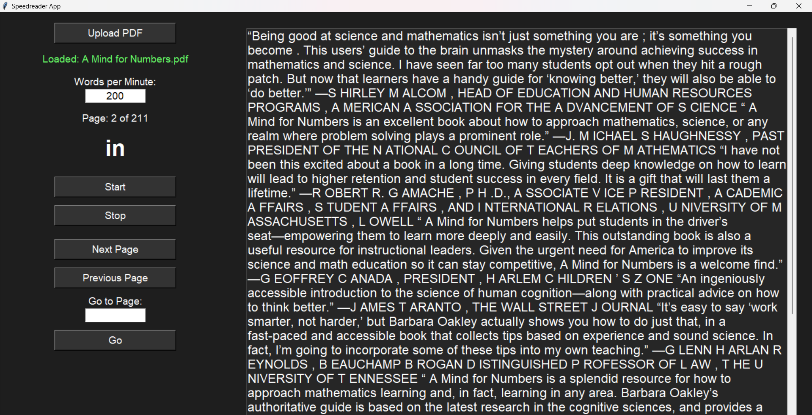

# Speedreader App

The Speedreader App is a personal project designed to enhance reading speed and comprehension. It utilizes a simple yet effective interface to display text from PDF files at a customizable speed. This application serves as a practical tool for anyone looking to improve their reading efficiency, whether for academic, professional, or personal development purposes.

## Reasons for Creating This App

As a frequent reader of PDFs, I found that traditional reading methods often led to distractions and reduced comprehension. I wanted a solution that would help me focus on the material while controlling the reading pace. This app was built with the following goals in mind:

- **Increase Reading Speed**: Allow users to adjust their reading speed to develop faster reading habits.
- **Focus on Content**: Minimize distractions by displaying text one word at a time or in small groups.
- **User-Friendly Interface**: Create an intuitive interface that makes it easy to upload PDFs and control reading settings.
- **Customization**: Enable users to set their preferred words per minute (WPM) and navigate through pages seamlessly.

## Features

### 1. Upload PDF
- Users can upload a PDF file from their local system.
- The app extracts text from the PDF, preparing it for display.

### 2. Adjustable Reading Speed
- Users can specify their desired reading speed in words per minute (WPM).
- The application calculates the appropriate delay between words based on the set WPM.

### 3. Display Current Page
- The app shows the current page number along with the total number of pages in the PDF.
- Users can navigate through pages using 'Next Page' and 'Previous Page' buttons.

### 4. Custom Page Navigation
- A text entry allows users to input a specific page number to jump directly to that page.
- The app validates the input and provides feedback if the page number is out of range.

### 5. Word Display
- The application displays words individually or in small groups in a dedicated area.
- The displayed text is styled for better readability, with adjustable font size.

### 6. Dark Theme
- The app features a dark theme for comfortable reading, especially in low-light environments.
- The user interface is designed to reduce eye strain during prolonged use.

### 7. Threaded Reading
- The reading process runs in a separate thread to keep the user interface responsive.
- Users can stop the reading process at any time with the 'Stop' button.

### 8. Error Handling
- The application includes error handling for file loading and input validation, providing helpful messages to the user.

## Demo

Here are some screenshots of the Speedreader App in action:

### Main Interface


<!-- ### Upload PDF
 -->

### Reading in Progress


## Installation

1. Clone the repository or download the source code.
2. Ensure you have Python 3 installed on your system.
3. Install the required dependencies using:
   ```bash
   pip install PyPDF2


#### Changes to be done:
- Fix the threadings
- Fix the book text display
- Add a database to keep track of till where the recent books have been read
- UI and feature improvements
- Theme toggle option  